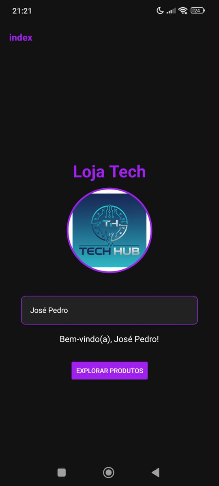
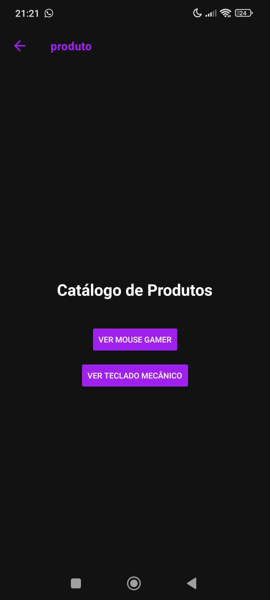
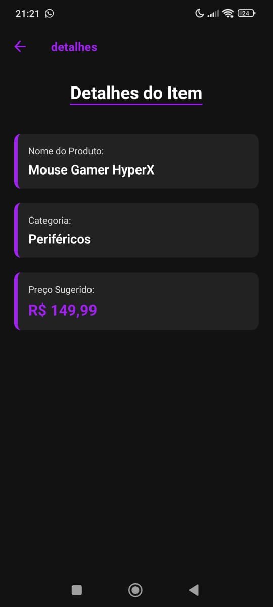
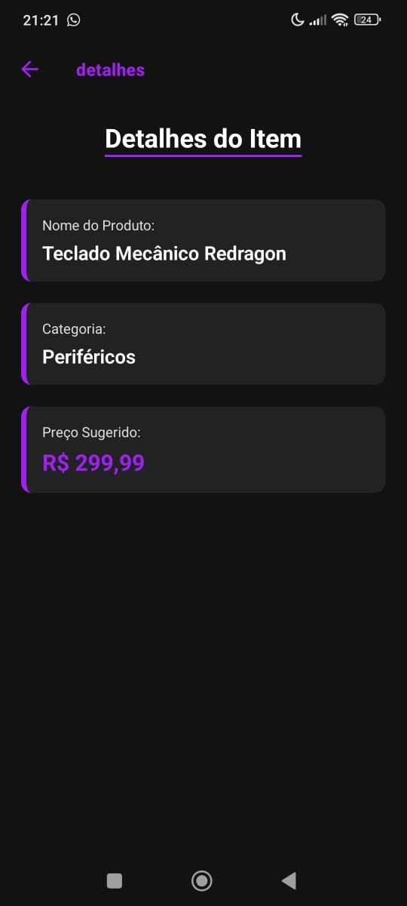

# 🚀 Loja Tech - Avaliação Prática

Este projeto foi desenvolvido utilizando **React Native** com **Expo Router** para a Avaliação Prática de Programação para Dispositivos Móveis. O projeto demonstra navegação entre telas, passagem e tratamento de parâmetros, além do uso de componentes essenciais.

## 🎯 Requisitos Implementados

* **Estratégia de Navegação:** Uso do Expo Router (Stack Navigation).
* **Passagem de Parâmetros:** Passagem do nome e preço do produto do Catálogo para a tela de Detalhes.
* **Componentes:** Uso de `Image`, `Text`, `TextInput` e `Button`.
* **Design:** Paleta de cores moderna (Preto e Roxo).

---

## 🖼️ Telas do Aplicativo

### 1. Tela Inicial

Apresenta a saudação personalizada via `TextInput` e o botão de navegação.

### 2. Catálogo de Produtos

Exibe os produtos e realiza a **passagem de parâmetros** para a próxima tela.

### 3. Detalhes do Produto: Mouse Gamer

Tela que recebe e exibe os parâmetros (`nome`, `preco`, `categoria`) passados.

### 4. Detalhes do Produto: Teclado Mecânico

Demonstra o mesmo layout, mas com parâmetros diferentes, provando o **tratamento dinâmico** dos dados.

---

## ⚙️ Como Rodar o Projeto

1.  Clone o repositório: `git clone https://github.com/JosePedro1/Loja-Tech.git`
2.  Instale as dependências: `npm install`
3.  Inicie o Expo: `npx expo start`
4.  Escaneie o QR Code com o aplicativo Expo Go.